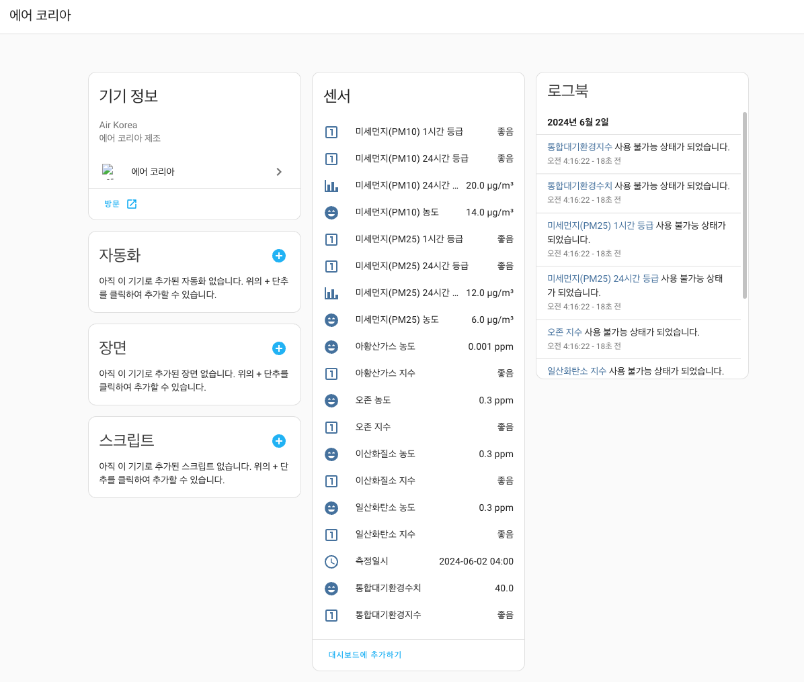
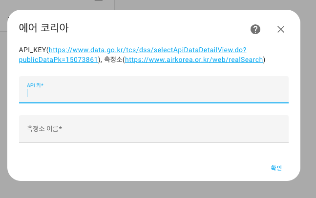

# 에어코리아

![HACS][hacs-shield]

문의 : 네이버 [HomeAssistant카페](https://cafe.naver.com/koreassistant)

## 에어코리아가 도움이 되셨나요?
| TOSS로 기부하기                                                                                                                                                         | 카카오 페이로 기부하기                                                                                                                                                         |
|--------------------------------------------------------------------------------------------------------------------------------------------------------------------|----------------------------------------------------------------------------------------------------------------------------------------------------------------------|
|  |  | 

## 준비물
- HomeAssistant `최신버전`

## 사용자 구성요소를 HA에 설치하는 방법
### HACS
- HACS > Integrations > 우측상단 메뉴 > `Custom repositories` 선택
- `Add custom repository URL`에 `https://github.com/stkang/ha-component-air-korea` 입력
- Category 는 `Integration` 선택 후 `ADD` 클릭
- HACS > Integrations 에서 `에어 코리아` 찾아서 설치
- HomeAssistant 재시작

### 수동설치
- `https://github.com/stkang/ha-component-air-korea` 에서 `코드 -> 소스 코드 다운로드(zip)` 을 눌러 파일을 다운로드, 내부의 `air_korea` 폴더 확인
- HomeAssistant 설정폴더 `/config` 내부에 `custom_components` 폴더를 생성(이미 있으면 다음 단계) 설정폴더는 `configuration.yaml` 파일이 있는 폴더를 의미합니다.
- `/config/custom_components`에 위에서 다운받은 `air_korea` 폴더를 넣기
- HomeAssistant 재시작

## 에어코리아를 설치하기 전 선행과정
### 공공데이터포털 회원가입 및 API키 발급받기
- [공공데이터포털](https://www.data.go.kr/) 에서 회원가입
- API 활용신청하기
- [한국환경공단*에어코리아*대기오염정보](https://www.data.go.kr/tcs/dss/selectApiDataDetailView.do?publicDataPk=15073861) 활용신청
- API키 확인(API키는 1회원 당 1개로 같은 API키로 여러개의 서비스를 호출 가능합니다.)

### 에어코리아에서 대기오염정보 측정소명 찾기
- [에어코리아](https://www.airkorea.or.kr/web/stationInfo?pMENU_NO=93) 에서 측정소명을 검색
- 측정소명이 "강남구 측정소" 일 경우 "강남구"를 기억하기

## 에어코리아를 통합구성요소로 설치하는 방법
### 통합구성요소
- HomeAssistant 사이드패널 > 설정 > 기기 및 서비스 > 통합 구성요소 추가
- 검색창에서 `에어 코리아` 입력 후 선택
- API key에는 공공데이터포털에서 발급받은 일반 인증키(Decoding) 키를 입력.
- 측정소에는 에어코리아에서 찾은 측정소명을 입력.

[hacs-shield]: https://img.shields.io/badge/HACS-Custom-red.svg